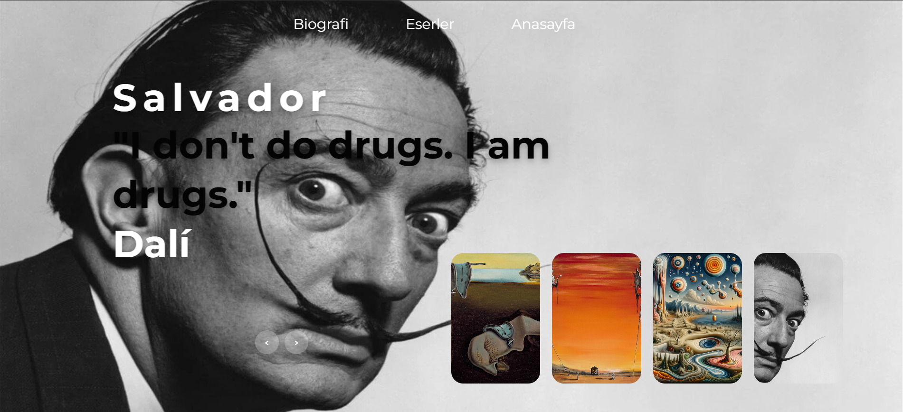
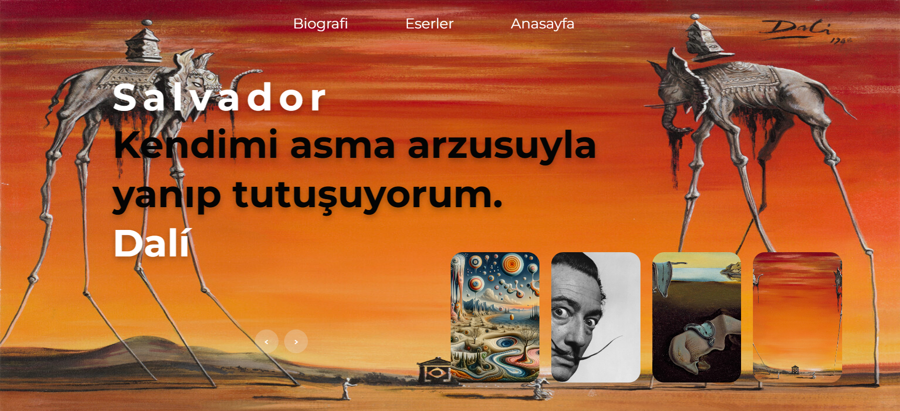
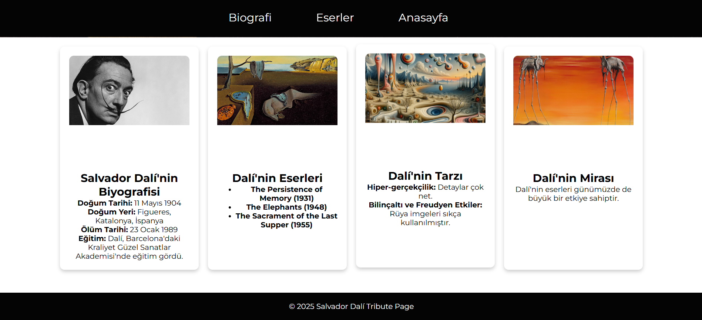
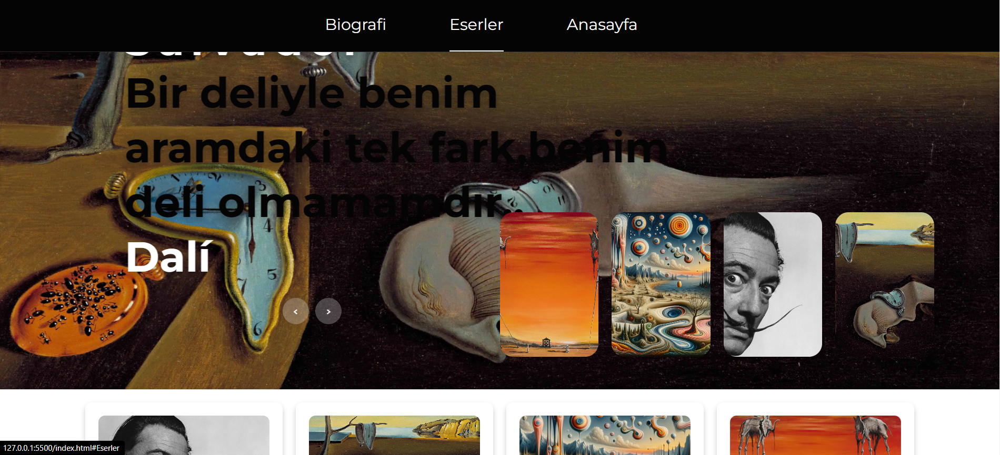

# Salvador Dalí Web Projesi

Bu proje, ünlü sürrealist sanatçı Salvador Dalí'nin hayatı, eserleri ve sanatı hakkında bilgi veren bir web sitesidir. Kullanıcılar Dalí'nin biyografisini, eserlerini ve sanattaki tarzını keşfetme fırsatı bulacaklardır.

## Proje İçeriği







- **Biyografi**: Salvador Dalí'nin hayatına dair bilgiler.
- **Eserler**: Dalí'nin önemli eserlerinin tanıtımı.
- **Sanat Tarzı**: Dalí'nin sanatındaki temel özellikler ve teknikler.
- **Miras**: Dalí'nin sanat dünyasında bıraktığı etki ve mirası.

## Başlangıç

Bu projeyi kendi bilgisayarınızda çalıştırmak için aşağıdaki adımları izleyebilirsiniz.

### Gereksinimler

- HTML
- CSS
- JavaScript (Opsiyonel: Dinamik içerik ve efektler için)

### Kurulum

1. Bu repository'yi klonlayın:
   ```bash
   git clone https://github.com/kullaniciAdi/dali-web-projesi.git
